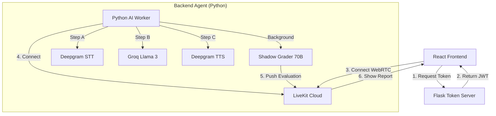

# AI Mock Interview Application 🎙️

> **Master your technical interviews with a real-time, voice-interactive AI coach.**

**Voice Coach AI** is an advanced mock interview platform that simulates real-world interview scenarios. It uses ultra-low latency WebRTC streaming to provide a seamless voice conversation experience, paired with a powerful "Shadow Grader" analysis engine that evaluates your performance in real-time.

---

## ✨ Key Features

- **⚡ Real-Time Voice Interaction**:
  - Sub-500ms latency using **LiveKit**, **Deepgram Nova-2** (STT), and **Deepgram Aura** (TTS).
  - Feels like a natural conversation, not a turn-based chatbot.

- **🤖 Dynamic Interviewer Personas**:
  - **Technical Interviewer**: Probes deep into code, trade-offs, and system design.
  - **HR Manager**: Focuses on culture fit, motivation, and soft skills.
  - **Behavioral Coach**: STAR method practice for leadership and conflict scenarios.

- **🕵️ Shadow Grader Engine**:
  - A background process powered by **Llama 3 70B** listens to the conversation invisibly.
  - Grades *every* Q&A pair individually for correctness, clarity, and depth.
  - **Zero Waiting**: Analysis happens while you speak, ensuring the final report is ready instantly.

- **imultaneous Feedback Report**:
  - Generates a detailed JSON evaluation immediately after the session.
  - Includes a **0-10 Score**, **Pass/Fail Decision**, **Strengths**, **Improvements**, and a question-by-question breakdown.

---

## 🛠️ Architecture

The system uses a **Dual-Service Architecture** to separate secure token generation from the heavy lifting of AI processing.



## 🚀 Getting Started

### Prerequisites

- **Node.js** (v18+)
- **Python** (v3.9+)
- **LiveKit Cloud Account** (Free tier available)
- **API Keys**:
  - LiveKit (API Key & Secret)
  - Deepgram (API Key)
  - Groq (API Key for Llama 3)

### 1. Installation

Clone the repository and install dependencies for both services.

```bash
git clone https://github.com/YourUsername/Voice-Coach-AI.git
cd Voice-Coach-AI
```

### 2. Environment Setup

Create a `.env` file in the root directory (or use the example):

```bash
cp .env.example .env
```

**Fill in your keys in `.env`:**

```env
LIVEKIT_URL=wss://your-project.livekit.cloud
LIVEKIT_API_KEY=your_key
LIVEKIT_API_SECRET=your_secret
DEEPGRAM_API_KEY=your_deepgram_key
GROQ_API_KEY=your_groq_key
```

### 3. Run the System

You need **3 terminals** to run the full stack locally.

**Terminal 1: Token Server**
Generates secure access tokens for the frontend.
```bash
cd backend
pip install -r requirements.txt
python server.py
# Running on http://localhost:5000
```

**Terminal 2: AI Agent**
The brain of the operation. Connects to the room and handles audio/LLM logic.
```bash
cd backend
python agent.py start
# Waiting for room connection...
```

**Terminal 3: Frontend Client**
The user interface.
```bash
npm install
npm run dev
# Open http://localhost:5173
```

---

## 📦 Project Structure

```
Voice-Coach-AI/
├── src/               # React Frontend
│   ├── components/    # UI Components (InterviewRoom, Visualizer)
│   ├── lib/           # Utils & Constants
│   └── App.tsx        # Main Entry Route
├── backend/           # Python Services
│   ├── agent.py       # LiveKit Worker & Shadow Grader Logic
│   ├── server.py      # Flask Token Server
│   └── Dockerfile     # Unified Container Setup
└── ...
```

## 🤝 Contributing

Contributions are welcome! Please follow these steps:
1. Fork the project.
2. Create your feature branch (`git checkout -b feature/AmazingFeature`).
3. Commit your changes (`git commit -m 'Add some AmazingFeature'`).
4. Push to the branch (`git push origin feature/AmazingFeature`).
5. Open a Pull Request.

## 📄 License

Distributed under the MIT License.
